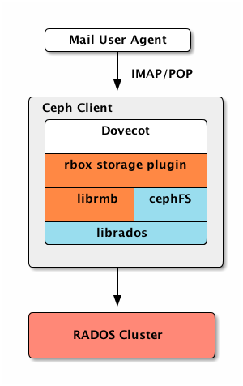
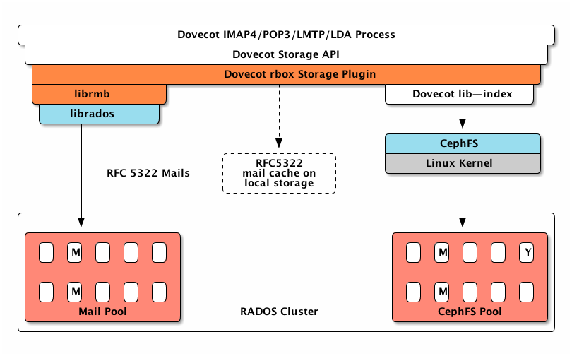

Ceph Plugins for Dovecot  
========================

The goal of this project is the creation of a storage plugin for Dovecot, which enables the storage of emails in Ceph RADOS objects. The focus is currently on a hybrid model where the emails are stored in RADOS objects, while all other metadata (lists, index, cache) are stored in a file system that is located locally on the Dovecot server or on shared CephFS volumes. The latter allows the operation of Dovecot completely on Ceph.

As a bonus, a dictionary plugin is included, which allows the storage of Dovecot dictionaries in Ceph OMAPs.

### Disclaimer

This project is under active development and not in any kind of release state. Be aware it is possible and very likely that APIs, interfaces and or the data format change at any time before a first release.

The code is in a tested state, but is NOT production ready. Although the code is still flagged as experimental, we encourage users to try it out for non-production clusters and non-critical data sets and report their experience, findings and issues.

It is planned to move all or parts of this code into other git repositories to move these parts later into other open source community projects like Ceph and Dovecot.

## RADOS Storage Plugin
### The Hybrid Storage Model

The mails are saved directly as RADOS objects. All other data are stored as before in the file system. This applies in particular to the data of the lib-index of Dovecot. We assume the file system is designed as shared storage based on CephFS.

Based on the code of the Dovecot storage format [Cydir](http://wiki.dovecot.org/MailboxFormat/Cydir) we developed a hybrid storage as Dovecot plugin. The hybrid storage directly uses the librados for storing mails in Ceph objects. The mail objects are immutable and get stored in one RADOS object.  Immutable metadata is stored in omap KV and xattr. The index data is completely managed by Dovecot's lib-index and ends up in CephFS volumes.

Because of the way MUAs access mails, it may be necessary to provide a local cache for mails objects. The cache can be located in the main memory or on local (SSD) storage. However, this optimization is optional and will be implemented only if necessary.

The mail objects and CephFS should be placed in different RADOS pools. The mail objects are immutable and require a lot of storage. They would benefit a lot from [erasure coded pools](http://docs.ceph.com/docs/master/architecture/#erasure-coding). The index data required a lot of writing and are placed on an SSD based CephFS pool.

A more detailed description of the mail storage format and the configuration of the rbox plugin can be found on the [corresponding Wiki page](https://github.com/ceph-dovecot/dovecot-ceph-plugin/wiki/RADOS-Storage-Plugin).  

## RADOS Dictionary Plugin

The Dovecot dictionaries are a good candidate to be implemented using the Ceph omap key/value store. They are a building block to enable a Dovecot, which runs exclusively on Ceph. A dictionary implementation based on RADOS omap key/values is part of the project. A  detailed description of the dictionary plugin can be found on the [corresponding Wiki page](https://github.com/ceph-dovecot/dovecot-ceph-plugin/wiki/RADOS-Dictionary-Plugin).  

## Compile and install the Plugins

To compile the plugin you need a configured or installed Dovecot >= 2.2.21.

### Checking out the source

You can clone from github with

	git clone https://github.com/ceph-dovecot/dovecot-ceph-plugin.git

Ceph contains git submodules that need to be checked out with

	git submodule update --init --recursive

The build requires that you have the following software/packages installed:

    jansson version >= 2.9
    librados2-devel (rados header) version >= 10.2.5
    dovecot-devel (dovecot header)

If you are using CentOS make sure you also have the following package installed:

    yum install redhat-rpm-config

### Standard installation in /usr/local

    ./autogen.sh
    ./configure
    make
    sudo make install

### User installation in ~/dovecot

    ./autogen.sh
    ./configure --prefix=/home/user/dovecot 
    make install

### Configured source tree in ~/workspace/core

    ./autogen.sh
    ./configure --with-dovecot=/home/user/workspace/core
    make install

## Thanks

<table border="0">
  <tr>
    <td>
    <td>The development of this software is sponsored by Deutsche Telekom. We would like to take this opportunity to thank Deutsche Telekom.</td>
  </tr>
  <tr>
    <td>
    <td>This plugin borrows heavily from <a href="https://github.com/dovecot/core/">Dovecot</a> itself particularly for the automatic detection of dovecont-config (see m4/dovecot.m4). The lib-dict and lib-storage were also used as reference material for understanding the Dovecot dictionary and storage API.</td>
  </tr>
  <tr>
    <td>
    <td><a href="https://www.tallence.com/">Tallence</a> carried out the initial development.</td>
  </tr>
  <tr>
    <td>
    <td>Wido den Hollander from <a href="http://www.42on.com">42on.com</a> for all the help and ideas.</td>
  </tr>
</table>
